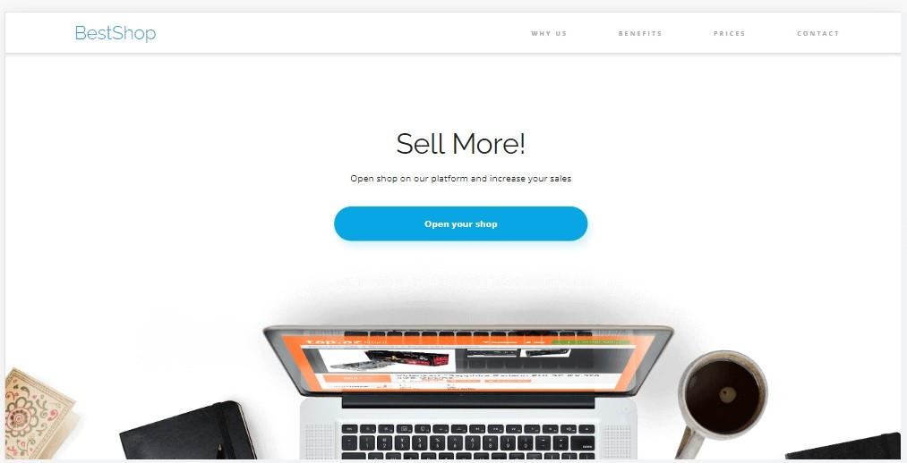
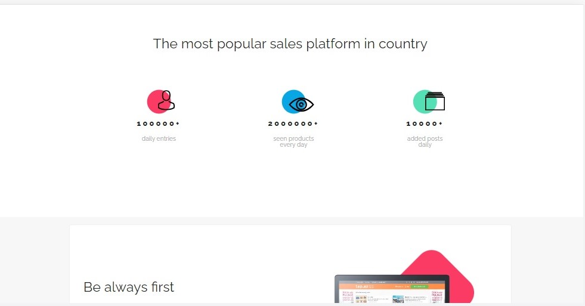
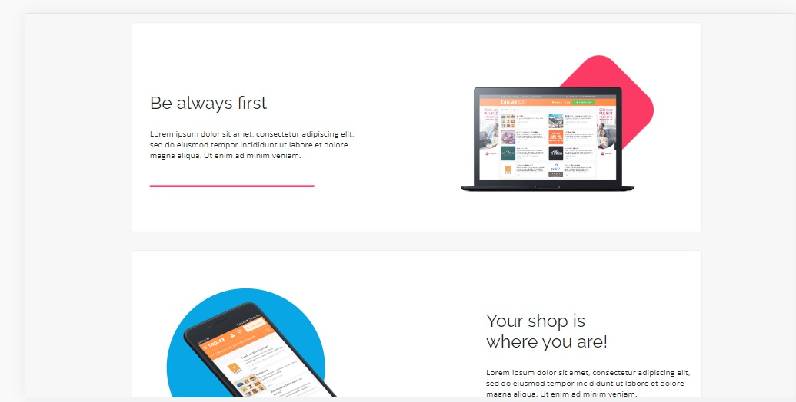
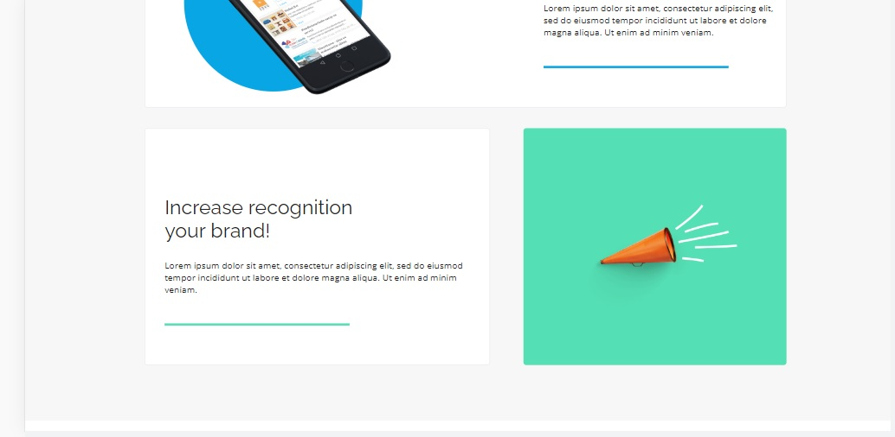
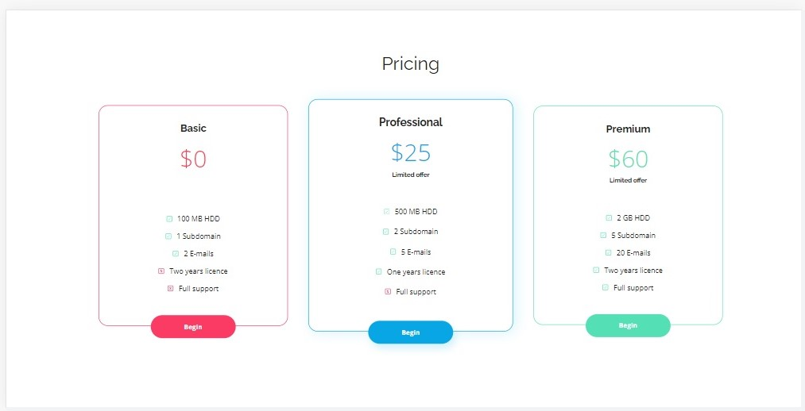
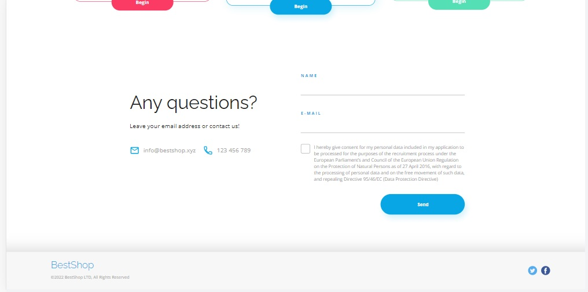

# BestShop - landing page (workshop)

 BestShop workshop1 is a simple one page webpage made for Coders Lab workshops.
    
 I used css, flex and html to create it 🎊

## 🙌About the Project
BestShop shows an example of landing page for an online store.
   
It has a navigation bar that takes you to individual sections of the page.
   
Also has a contact form and a checkbox to indicate consent to the use of the data provided.

## ✨Technologies Used

## 💻Screenshots

    
    
    
    
    
    

